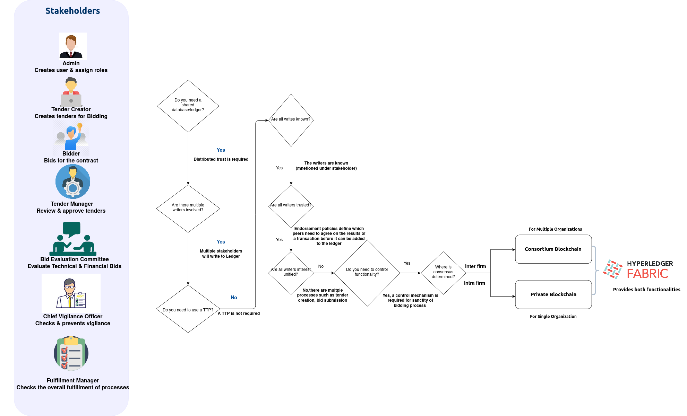
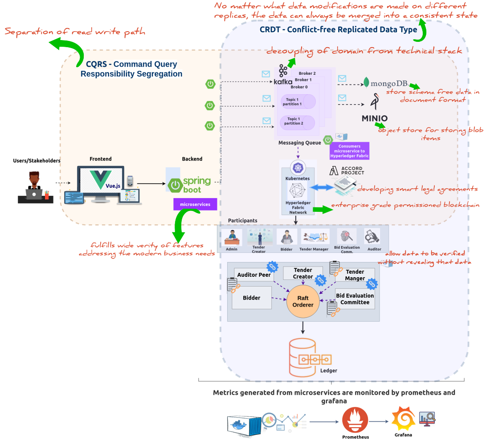
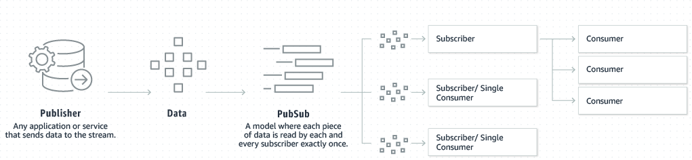
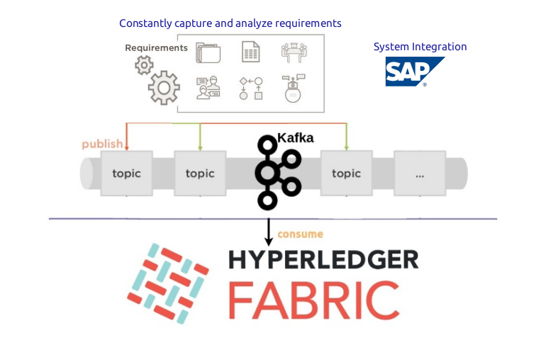
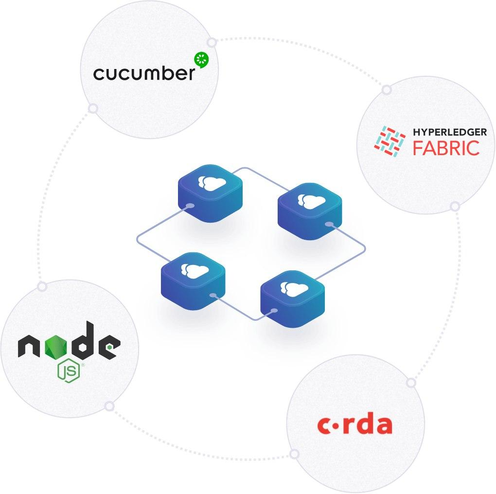
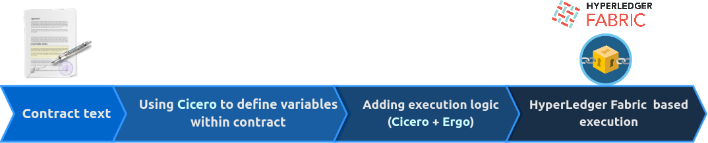
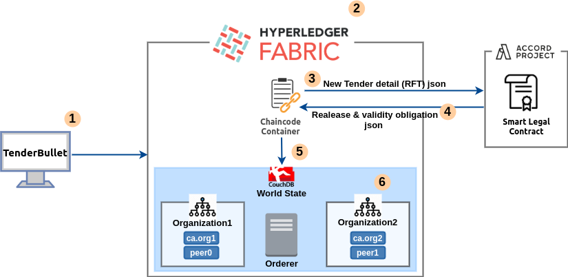
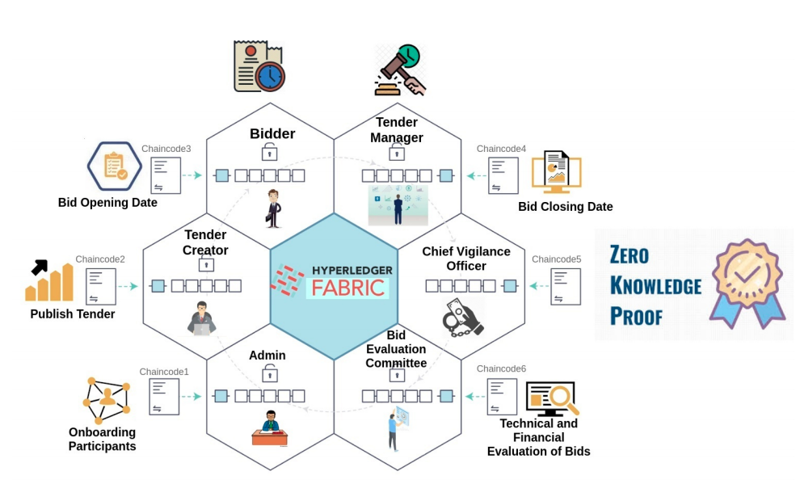
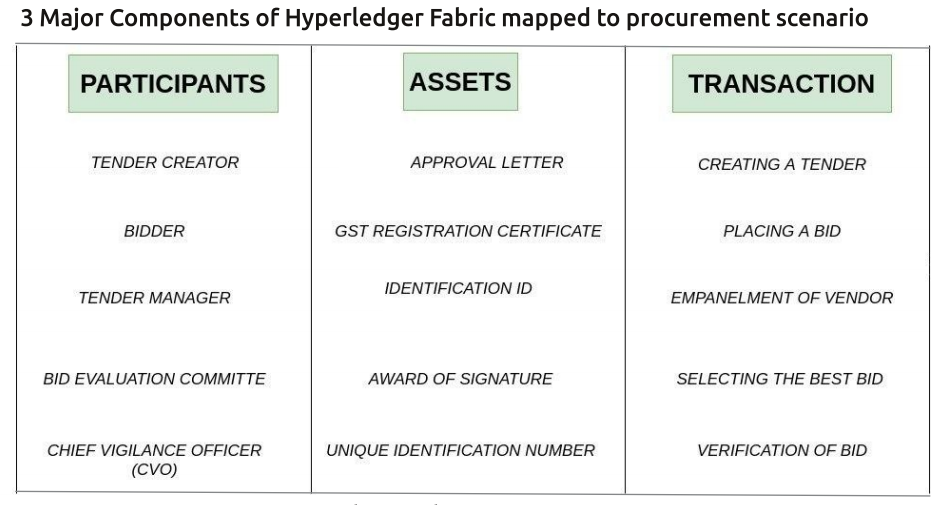

APPENDIX
=========

.. image:: images/blankspace.png

Blockchain Selection Strategy
+++++++++++++++++++++++++++++

    To view image right click on image to open in new tab

Interest in blockchain technology has exploded over the past several years. Distributed ledger technology can solve many of the issues emerging from our increasingly connected society, as well as addressing real-world business concerns.

To choose the selection strategy the following questions should be put forth which will help the organizations that choose to adopt it can have a better strategy in finding the correct blockchain for their organizations.

As procurement is an organizational need which requires a shared database to add the blocks of the entire bidding processes the shared ledger and database is a primary part of the blockchain for procurement.

And as there are different stakeholders like tender admin, bidder, bid evaluation committee a tender manager and all these writers are trusted and added to the blockchain after running through their transactions, these parties are added to the blockchain group.

As the above points are attributes of a “consortium” blockchain which is also a “Private” blockchain used by most of the organizations which do not want their data to be in a shared ledger.

.. image:: images/blankspace.png

Technical Architecture
++++++++++++++++++++++

**Building Blocks of our Solution** -

1.  **Vue.js** - is a progressive framework for building user interfaces. It is designed from the ground up
    to be incrementally adoptable and can easily scale between a library and a framework depending
    on different use cases. In the ever-changing world of front-end JavaScript frameworks, one of the
    emerging favorites appears to be Vue.js.
    Vue.js is a lightweight alternative to AngularJS & React.js. It is designed to be a very flexible—and
    a less opinionated—library that offers a set of tools for building interactive web interfaces around
    concepts such as modularity, components and reactive data flow.

2.  **Springboot Microservices** - Microservice architectures are the ‘new normal’. Their small scale and
    relative isolation can lead to many additional benefits, such as easier maintenance, improved
    productivity, greater fault tolerance, better business alignment, and more. With Spring Boot,
    microservices can start small and iterate fast. That’s why it has become the de facto standard for
    JavaTM microservices.

3.  **CQRS** - stands for Command Query Responsibility Segregation. The pattern proposes separating
    the write data model from the read data model. using commands to update data, and queries
    to read data. CQRS is ideal for our solution as scalability is an essential requirement for the
    platform.

4.  **Apache Kafka** is a distributed data store optimized for ingesting and processing streaming data in
    real-time. Kafka provides three main functions -

    * Publish and subscribe to streams of records

    * Effectively store streams of records in the order in which records were generated

    * Process streams of records in real time

    In our architecture Kafka is used as a message broker solution, it processes and mediates
    communication between multiple apps.

**Apache Kafka** brings agility and enhances the adaptability of our solution. It provides decoupling of core
infrastructure from domain {user stories / workflows}

5.  **MongoDB** a document database, it stores data in JSON-like documents. The document data
    model is a powerful way to store and retrieve data that allows developers to move fast, scale-out
    architecture can support huge volumes of both data and traffic. It will be one of the consumer
    microservice which will save data to DB.

6.  **MinIO** - is a high-performance and distributed object storage which will be used in our case to
    store blob items. It is an API compatible with Amazon S3 cloud storage service.

7.  **CRDT** - stands for Conflict-free Replicated Data Types, are family of replicated data types that have
    a common set of properties that enable operations performed on them to always converge to a
    final state consistent among all replicas. To ensure that conflicts never happen and cause
    problems in our solution incorporating CRDT will provide a solution for merging and resolving
    conflicts in the presence of concurrent updates.

8.  **Accord Project** - establishes an interoperable approach for creating smart contracts which bind
    legally enforceable natural language 
    text to executable business logic. Tenderbullet aims to create a blockchain-based business network on the Hyperledger Fabric that
    invokes Accord Project components to execute Smart Legal Contracts.

     Accord Project touchpoints

.. image:: images/blankspace.png
     :align: center

The four essential tools our solution will include -

    *   **Cicero** - implementation of the Accord Project Template Specification. It provides a universal
        format to structure contract clauses, sections, or whole contracts as machine-readable objects.

    *   **Ergo** is a computer language for writing smart legal contracts. The language is blockchain neutral:
        the contract logic can be executed on and off chain on a variety of distributed ledger technologies.
        It is modular, allowing for the reuse of the existing contract or clause logic.

    *   **Template Library** - The library holds all Accord Project contracts and clause templates developed
        so far. The templates are produced using the Accord Project Cicero format.

    *   **Model Repository** - holds standard reusable data models that can be imported and used within
        the Smart Legal Contract Cicero templates and in Ergo logic.

9.  **Hyperledger Fabric** - is a platform for distributed ledger solutions, underpinned by a modular
    architecture delivering high degrees of confidentiality, resiliency, flexibility, and scalability. It is a
    permissioned and enterprise grade solution. We aim to use the Raft consensus algorithm, as it
    allows different organizations to contribute nodes to the ordering service, enabling more
    decentralized network architecture.

