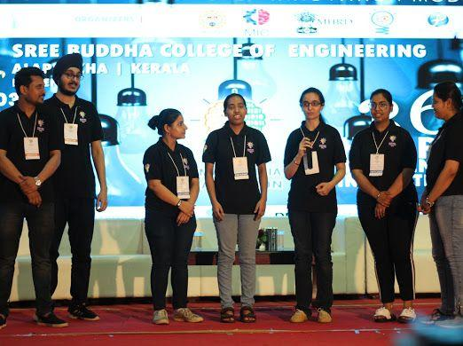
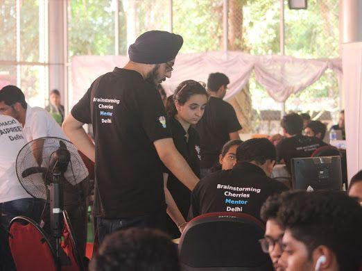
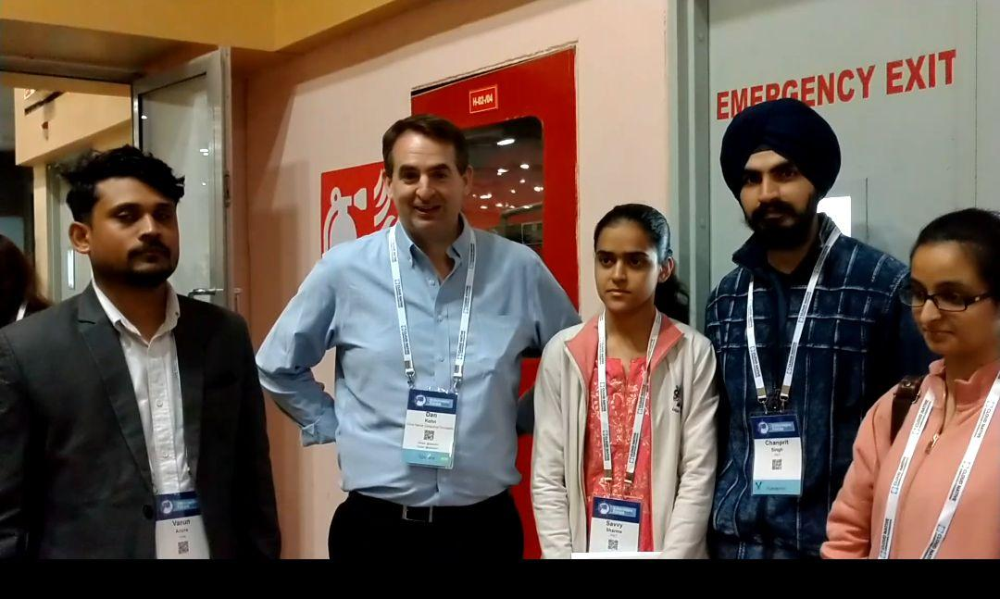
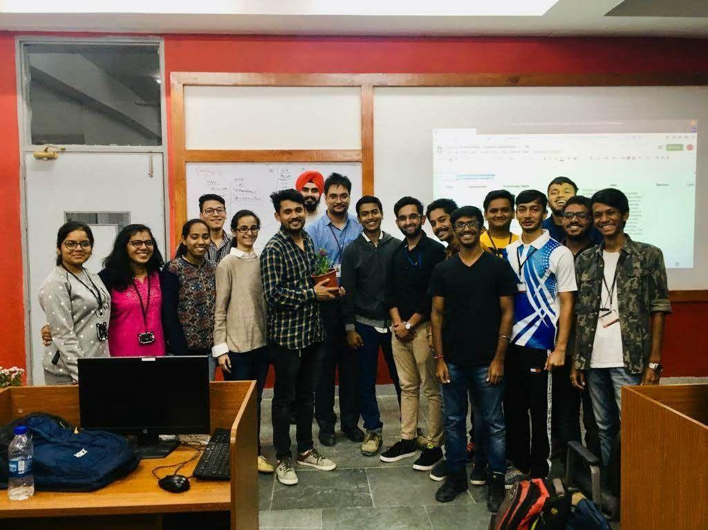
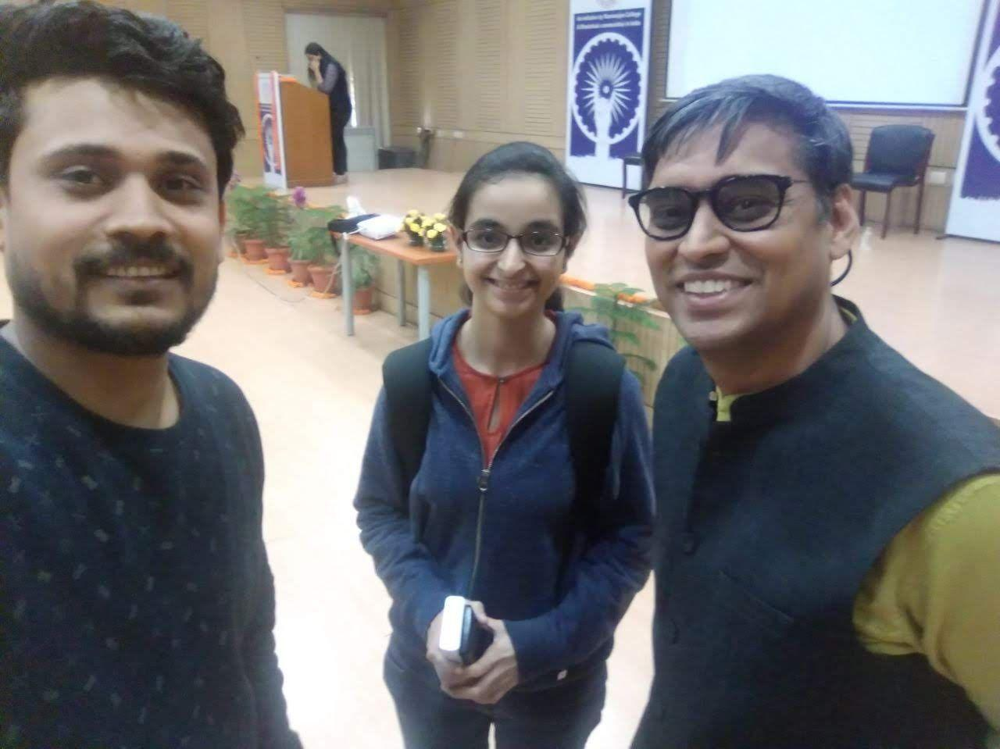
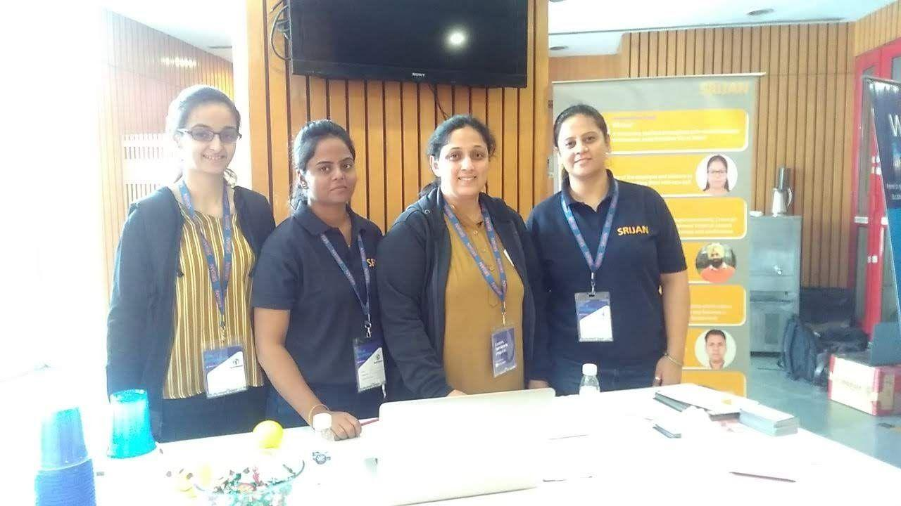
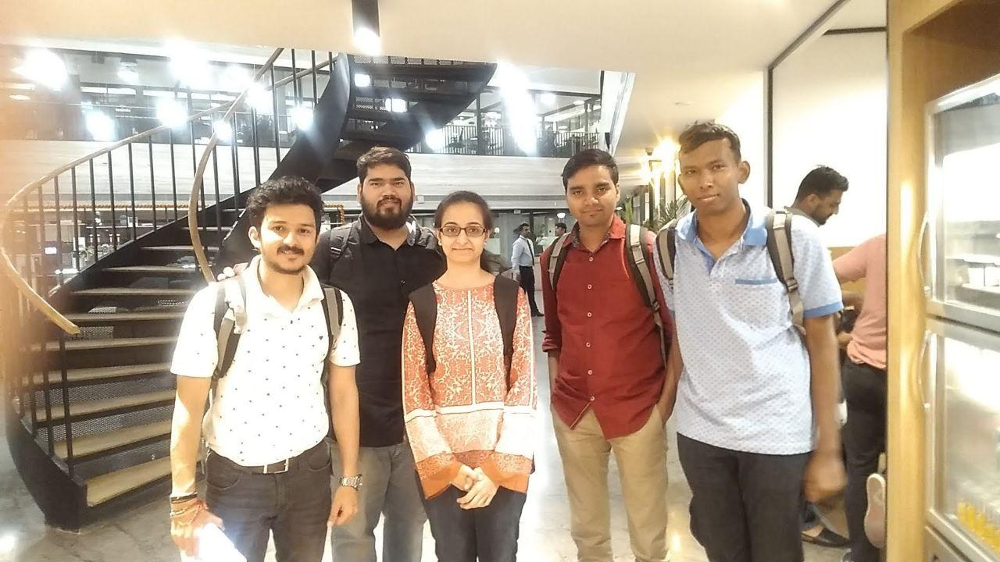
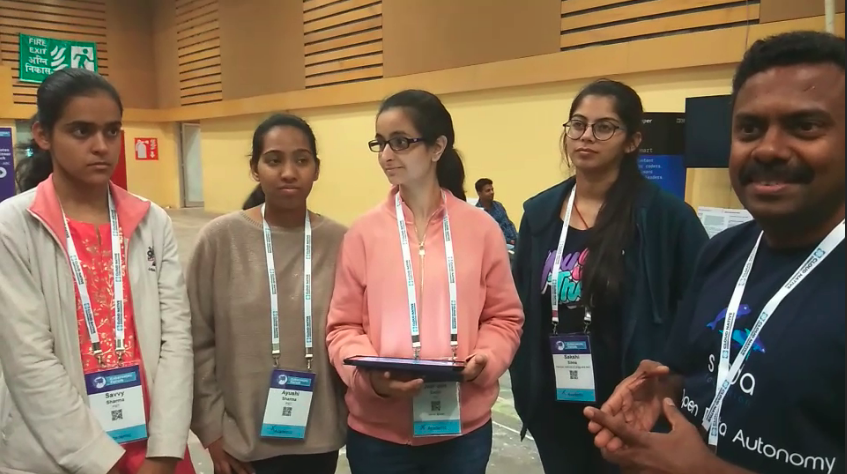
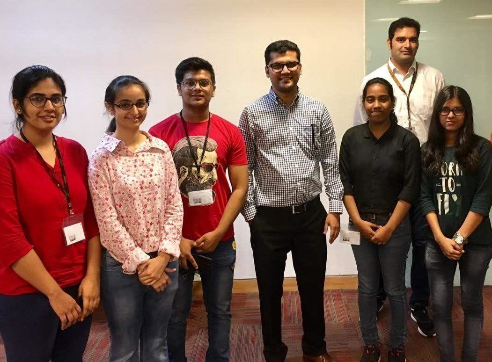

The Trivial Ending
==================

.. image:: images/blankspace.png
     :align: center

Journey Document
++++++++++++++++

**Proposed blockchain based solution to Amadeus for GDPR based personlaization during Smart India hackathon 2019**

.. image:: images/blankspace.png
     :align: center

**With my team Brainstorming Cherries in Kerala during Smart India Hackathon**

.. image:: images/blankspace.png
     :align: center

**Met Dan Kohn  (Executive Director at Linux Foundation) at KubeCon 2020 India**

.. image:: images/blankspace.png
     :align: center

**Conducted Hands-on Big Data Lab at Chandigarh University**

.. image:: images/blankspace.png
     :align: center

**Met Deepak Lalan (Blockchain Associate Director at Accenture) at Global Fintech conference India 2019**

.. image:: images/blankspace.png
     :align: center

**Student Volunteer at Tech Triveni Conference organized by Knoldus**

.. image:: images/blankspace.png
     :align: center

**Attended Kubernetes Meet-up at Wework conducted by Knoldus Team India**

.. image:: images/blankspace.png
     :align: center

**With Sanil Kumar, India Chief Architect Huawei (Currently opensource contributor at Soda Foundation)**

.. image:: images/blankspace.png
     :align: center

**Met Docker Executive Director(Chicago),during his visit to India**

.. image:: images/blankspace.png
     :align: center

