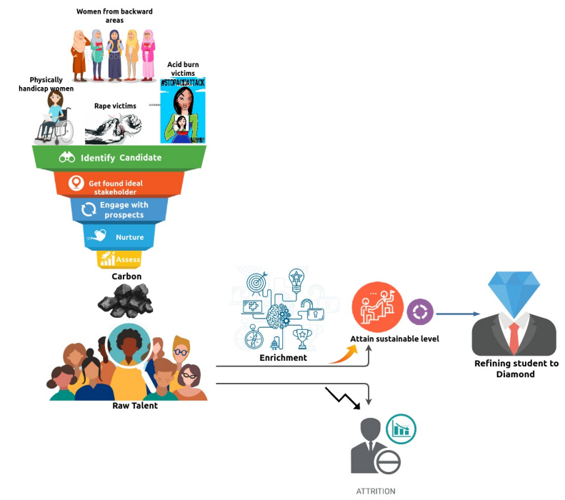

Team Profile
############

   Joy from India

``Joy`` has graduated from a mediocre college for sake of a degree. An average student & has not trodden through the conventional route. But, now she is striking out a new path for herself.
Passionately aim to build - Aliyda: A Blockchain-based platform for rape victims. This solution will address numerous acute pain points that cause unnecessary delay in the deliverance of justice.

    Bringing the top of the pyramid knowledge to bottom of the pyramid students

Luckily, Joy has been part of a grass-root level initiative “Osive” which strives to achieve the goal of: “Bringing the top of the pyramid knowledge to bottom of the pyramid students”. This helped her evolve from a nobody to a person of value who could conduct technical knowledge imparting sessions at many Tier-2 and Tier-3 colleges.

Made grass-root level efforts along with my peers to formulate: “Talent Enrichment Pipeline". Vision is to filter raw talent, enrich the students with core technical knowledge, and refine them to diamonds.

    Talent Enrichment Pipeline

.. figure:: images/blankspace.png
    :align: center

.. figure:: images/naveen.png
   :align: center

   Naveen from Canada

``Naveen`` is a graduate in Computer Science and Engineering and is working in the IT Industry for the past 10 years. Initially started his career as an Oracle Technical Developer and moved towards Functional/Business Analysis in Oracle and then in Salesforce. He has worked on 5 implementations of CRM Modules in Oracle and Salesforce across all Geographies. Supply Chain enthuse me since the world economy revolves around supply chain and bringing blockchain to the more robust supply chain modules will help both the technology and the market grow with easier access to goods across all over the world.

.. figure:: images/saiju.png
   :align: center

   Saiju from Canada

``Saiju`` is a Software Designer at the College of Physicians and Surgeons of Ontario in Toronto. He works with Microsoft 365 and enthusiastic about new technologies like blockchain.

.. figure:: images/aparna.jpg
   :align: center

   Aparna from Canada

``Aparna`` has a Master's in Computer Science and Software Engineering from NIIT.A Quality Assurance Analyst and UAT Specialist with around 6.7 years of experience in the IT and Banking industry. She has been involved with Automation testing, Manual testing and Project management.Also have experience working as a Content Development Editor.She managed and worked on projects and with Stakeholders from across the globe.
She has been associated with JP Morgan Chase, Tata Consultancy Services and Packt Publishing as part of my career.
Currently pursuing Blockchain Development program from George Brown College(Canada).