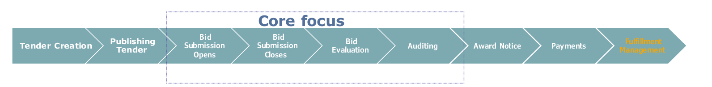
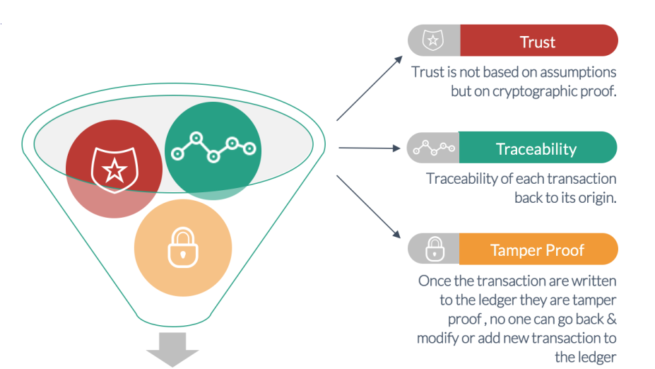

The Introduction
================

.. image:: images/blankspace.png
     :align: center

Abstract
++++++++

Across the world , society's trust in institutions has been suffering due to numerous corruption scandals.
Commercial corruption is a major problem worldwide, costing taxpayers up to $ 2 trillion a year. Tenderbullet blockchain-powered platform will allow the permissioned network to be in place eliminating the need for royalty and any middle authority. TenderBullet platform will use permissioned blockchain to secure transactions such as the creation of tender documents, submission of applications, sending bid proposals, validating company profiles, past records, official approval details, refusal details to ensure the tender process is completely transparent.

.. image:: images/blankspace.png

Problem Statement
+++++++++++++++++

* **To integrate Blockchain into Tendering process.**

Globally, the potential for corruption is exploited where there is a conflict of interest & misue of power by higher authorities. With the scale of many public contracts, which can be worth several million dollars, procurement systems are a vital part of a country’s spending.

Procurement is the purchase of goods and services by the government sector & is considered a key economic activity within government departments, accounting for, on average, 15% of GDP worldwide. In India particularly, government tendering activity constitutes about 30% of the GDP, which is much higher as compared to other countries.

``Tendering-based frauds`` - A purposeful imposture intended to influence any stage of the tendering lifecycle to make a financial gain. It can be committed by any stakeholder external to the organization, as well as staff within the organization.

``Existing tendering system`` -  corrupt manual processes existing in systems involved are not interoperable

``Stakeholder Involvement and roles`` - Lack of a clear channel of communication & an effective system that can track the process

``Criteria for assessing effectiveness`` - Lack of transparency and openness of procurement processes, affordability, feedback mechanisms, knowledge of the system

``Dark Purchasing`` - Undefined and undocumented purchase outside the defined procurement The process is called Dark Purchasing. Such purchases cause irreparable losses and are expensive to business.

    .. figure:: images/Frauds.png
       :align: center

       Stats - areas where Tendering Fraud occured

.. image:: images/blankspace.png

Context
+++++++

• Motivation - Lokpal Bill ( draft anti-corruption bill)
• No one hit wonder
• No cryptocurrency needed

* Lokpal Bill is a draft anti-corruption bill drawn up by prominent civil society activists in India, main purpose of this bill is to decrease the overall corruption and listen to the grievances of the citizens of India. Although many activists have tried, they have not been able to pass the bill in the Indian Parliament due to corruption found at various levels in the Indian government. The bill has not passed yet, and an undue delay is there. Lokpal bill is similar movement happening across the world for example -

    * **1989 Tiananmen Square Protests**

    * **2018–2020 Serbian protests**

* All these movements are fundamentally trying to uproot corruption.
  Tendering to be the most fundamental government engagement needs to be transparent. In India, as in
  the rest of the world, there is massive corruption occurring in Tenders in various government agencies.
  These cost taxpayers millions of dollars. One of the causes of are various stakeholders involved in the
  process. Also, records can be changed easily to meet a nefarious requirement.
  We are proposing a system that will use blockchain to make the tendering system transparent. We aim to
  build a blockchain powered platform for State Governments to enable permanent and tamper-evident
  record keeping which will bring transparency and auditability in real-time.
  The goal is to create a ground-breaking technology that supports and integrates government
  organizations with technology, synthesizing them perfectly to create a tamper proof bidding and contracts
  using the multipurpose platform that is destined to flourish in other private organizations for societal
  growth.

* A One-Hit Wonder is a success or achievement achieved in the only and only first and last performance of a product or an album.

  This project is not a ``One-Hit`` wonder to reach and be used by all the organizations which has a procurement involved and wants to come up clean with the transactions that happens within the organization to provide a transparency.

  The mistake and the errors in this project will be corrected and the lessons will be taken into the next release of the project along with the fixes and suggestions that are provided.

  As and when the technology evolves the project and its effectiveness to create a transparent aspect of the entire procurement process is included in all its future development.

* A cryptocurrency is a new form of digital asset based on a network that is distributed across many computers. This decentralized structure allows them to exist outside the control of governments and central authorities.

  As far as this project is considered, this network is accessible only to those who have permission and transactions can be edited by administrators.

  So, developing or using a cryptocurrency is not in our usecase.

.. image:: images/blankspace.png
     :align: center

Background
++++++++++

* Procurement relies in an apparent irreconcilability between competition, which implies some confidentiality, and transparency
* Procurement functions can benefit hugely from the speed and efficiency of blockchain, and its
  transparency and immutability will embed trust between parties as transactions and agreements become absolutely verifiable.

In most countries the chosen government or entities of the same has a higher responsibility to develop
and lift the quality of life of the society living in with quality education, better infrastructure, basic
sanitation, good drinking water and availability of food, shelter, and education. These are needed for the
prosperity of any nation to progress. In a democratic country the people’s representative, along with the
people who chose them, handle building a nation with such basic amenities.
For any development to take place the government alone cannot build the nation and it must use the tax
paid by the people and its revenue to design and develop a nation with a better infrastructure along with
partners who can supply support in the form of supplying raw materials for the development.
In this scenario the supplying organizations are called from a pool of available suppliers to quote a price
for the raw materials that are requested by the government and here comes the tendering process where
the government advertises a tender including the required materials for a school building for example.
These scenarios were tried to be controlled by the Government of India through Lokpal Bill, but it was not
passed in the parliament due to undue delay by the politicians because this bill will bring the required
transparency and eradicate corruption in the procurement of materials for the government.
This blockchain project “TenderBullet” is a brainchild of good Samaritans who wants their country to
prosper and have infrastructure that should be on par with developed nations. As by saying it goes a
nation will move forward only when it has the basic amenities like Education, sanitation, and
infrastructure.
This also means this project will have checks and validations with multiple stakeholders to confirm all the
actors who are involved in this. And at various stakeholder levels they make sure that the entry into the
procurement process under blockchain comes under scrutiny and there is a less non-transparent aspect
to the entire process.
This project uses Hyperledger fabric with Kafka to enable a tendering process that can be implemented
within an organization and allows only known stakeholders to play a role. With the zero-knowledge
transfer mechanism the bidders will not know each other's quotation and they will not be able to know
what goes into others' submission which makes it easier to confirm the bid based on the quotation by the
bid evaluation committee.
Through this we also will be addressing to eradicate any unethical issues that may occur in the entire
process and cover those using the legal and law regulations for the entire process so that it remains a fool
proof mechanism and brings in confident among people about the government that helps them to have
a better-quality life.

.. image:: images/blankspace.png
     :align: center

Tenderbullet Video
++++++++++++++++++

.. raw:: html

        <video controls src="../../_static/tenderbullet.mp4" width="800">

.. image:: images/blankspace.png

Solution
++++++++

* **Blockchain powered Procurement Platform – Tenderbullet**
* **Incorporating Permissioned Blockchain Network using Hyperledger Fabric & Accord Project for Smart Legal Contracts**
* **Advanced validation and authentication**
* **Fair enquiries management**
* **Indestructible audit trail**
* **Prominent security of transactions**

TenderBullet is one stop platform which will connect major stakeholders of procurement /tendering process. Consider
platforms like Amazon for shopping & Instagram for social networking, similarly we aim to build our platform
for procurement.

If we consider any organization(public/private), it does business with a high volume of suppliers & there are multiple phases involved in tendering process such as onboarding stakeholders, creating tenders, receiving bid submissions, evaluating the bids & managing open tenders etc. Primitive models force manual effort to facilitate constant checks, updates, and heavy-maintenance across siloed systems. With our solution, blockchain technology will create a unique source of truth, allowing each peer to own, control, and access data, providing benefit to all stakeholders involved and reducing issues of  quality degradation.

With our solution, all participants in the permissioned network can drill down as per their roles and obtain clear  details on the origins, purity, and authenticity of the product, while also providing traceability in the event of tendering process.

The Accord Project stack will be used to develop on top of Hyperledger Fabric to add a legal contract layer for users of enterprise blockchain network.

.. image:: images/blankspace.png
     :align: center

**Phases of Tendering & Core focus** -

* The first and foremost phase for any tendering process is on-boarding of stakeholders.With role based access, relevant authorisation and background check stakeholders are onboarded on the platform.
* Based on the services and product requirements, a tendering organisation initiates the process of putting out a request fortender.
* The tender with its full specification would be published through the tendering host. A tender specification would include the terms and conditions of the tender, information necessary for an acceptable bid, and bid evaluation criteria
* An interested bidding organisation would download/access the tender specification
* Based on the tender specifications, the bidding organisation would prepare a bid
* The prepared bid is submitted (Submission of the bids would be open for a limited period– depending upon the tender specification.)
* Bid Evaluation committee will evaluate all of the submitted bids as per the evaluation criteria stipulated in the tender specification
* Based on the evaluation, the best bid would be selected and notified by the tendering organisation
* The Chief Vigilance officer have to be resourceful of complete activity and can a audit trail to find discrepancies if any.

Private blockchain will ensure that only parties involved in the tendering process can participate in the blockchain network, thereby ensuring the privacy of information, or data shared in a public procurement process. Relevant smart contracts
will be incorporated on each phase so as to maintain sanctity of bidding process.

.. image:: images/blankspace.png
     :align: center

* Eliminate corruption
* Bring transparency & integrity
* Make it tamper-proof

