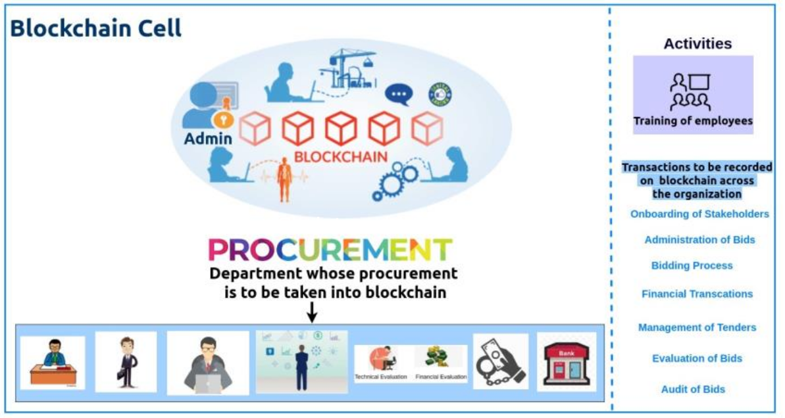
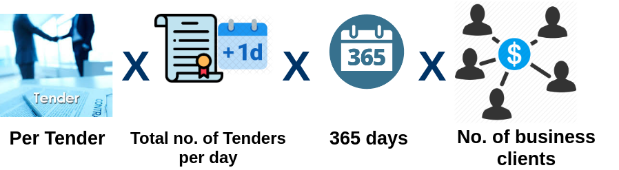
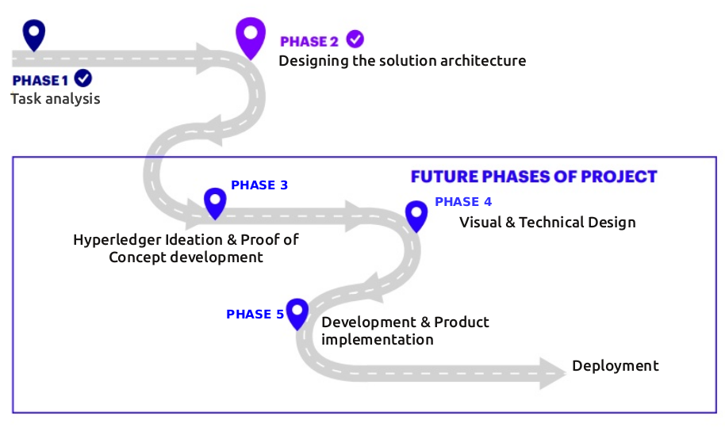

The End
=======

.. image:: images/blankspace.png

Adoption Strategy
+++++++++++++++++

Any project has a potential to deliver unexpected results until and unless we focus on user adaption strategy. Most technology user adaption is the main cause of failure. You need to think carefully how we will onboard the stakeholders into a project after the project is developed from technical point of view

Used properly, key competitive advantages can be gained. However, without proper user adoption you risk spending time and capital to build something that will hinder your operations. All solutions should be developed using best practices in user experience design, but it takes more than that to succeed.

Following are the activities that are advised under “Training of Stakeholder” in “TenderBullet” project.

The transactions that are created in the blockchain are to be recorded across the organization.

The users are provided the strategy and the steps to onboard the key stakeholders that are going to be part of the blockchain.

They are provided with training on administration of bids and the entire bidding process, so the administration process is strongly audited before they admit a stakeholder into the blockchain.

The audit of the financial transactions of the bidders which is necessary to asses a bidder is defined, also they are trained to handle and manage the tenders that are floated by the tender manager.

Once the bidder submits the bids the evaluation of the same along with the Audit of Bids are considered to take the bidders as a key player in the “TenderBullet” project.

.. image:: images/blankspace.png

Business Model
++++++++++++++

One needs a clear path to build something meaningful. The process of building a business model establishes a plan for how you will realize your vision. It lays out the strategy behind a new undertaking or investment and provides a framework for tracking progress.

Creating a business model requires deep thought and analysis. Company and product builders must think from the outside in, focusing on market needs and what matters most to customers. Once built, sharing your business model across the organization encourages alignment. This keeps everyone accountable for what they are working on and why, as well as guiding investments of time and resources.

The business model for this “TenderBullet” is as follows.

The business model of this project starts with pay per tender model.

The project is sold to any intra organization with the pay per tender model along with the total number of tenders per day for the whole year along with the number of business clients that are going to use the project.

Revenue Model = Per Tender X Total No. Of Tenders Per Day X 365 Days X no. Of Business Clients.

.. image:: images/blankspace.png

Phases of implementation
++++++++++++++++++++++++

.. image:: images/blankspace.png

Conclusion
++++++++++

There are lot of open items when it comes to amalgamation of ethics , law (as code) and Blockchain. We have presented a path that involved using Hyperledger Fabric as private permissioned blockchain infrastructure ,  Accord Project for incorporating Law related components, but ethics is still widely left uncharted tangent .

